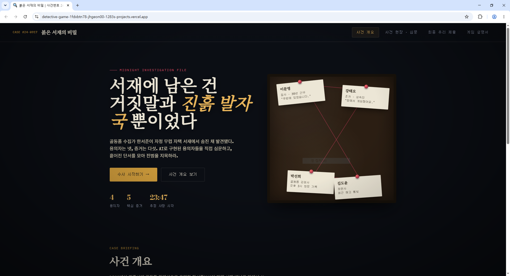
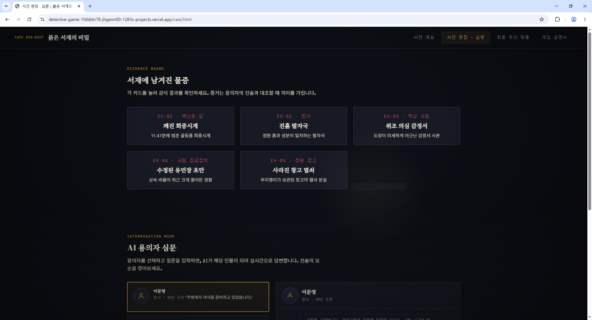
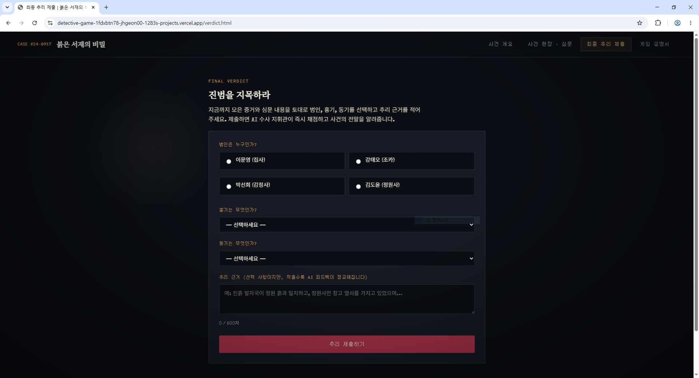
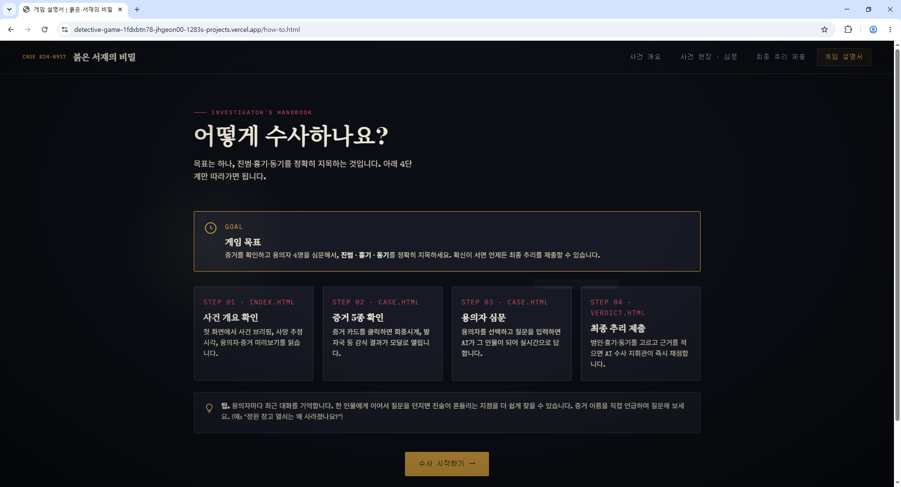
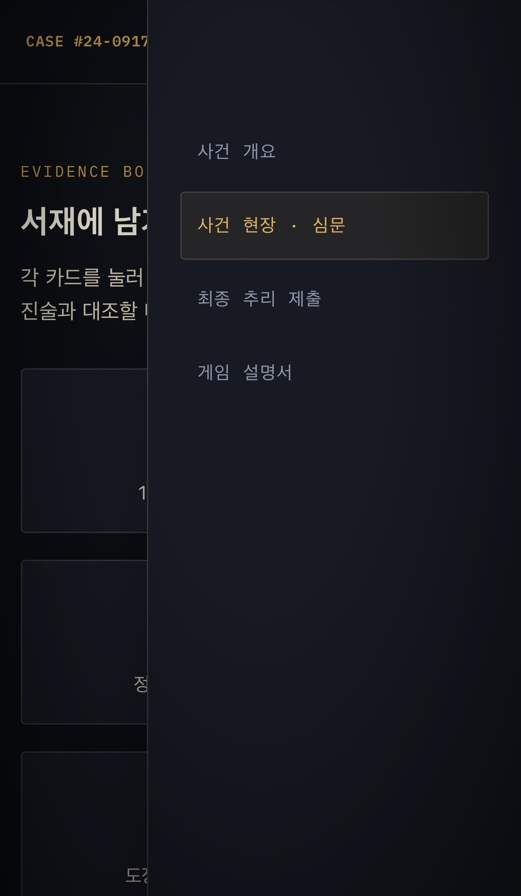
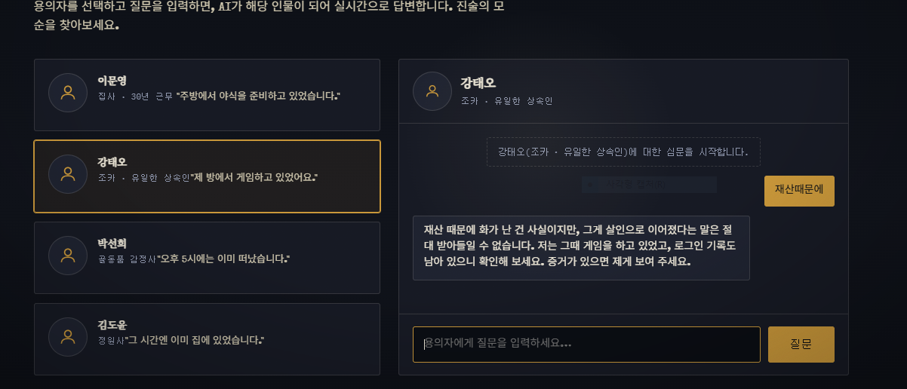

# 🔍 붉은 서재의 비밀 (CASE #24-0917)

AI 용의자를 직접 심문하고, 증거를 모아 진범을 지목하는 **인터랙티브 추리 웹게임**입니다.

- 배포 URL: https://detective-game-pi.vercel.app
- GitHub 저장소: https://github.com/JEONG-HEEEON/3A3

> 참고: 위 배포 URL은 특정 배포 시점에 고정되는 형태의 주소입니다. Vercel 프로젝트의
> `Settings → Domains`에 무작위 문자열이 없는 짧은 프로덕션 도메인(예: `3-a3.vercel.app`)이
> 별도로 있다면 그 주소를 제출용 대표 URL로 사용하는 것을 권장합니다.

---

## 1. 서비스 소개

골동품 수집가 한서준이 자택 서재에서 살해된 채 발견된다. 집사, 조카, 골동품 감정사,
정원사 4명의 용의자가 있고, 각 용의자는 AI로 구현되어 실시간으로 심문에 응답한다.
플레이어는 증거를 수집하고 용의자를 심문한 뒤, 범인·흉기·동기를 최종적으로 지목하면
AI 수사 지휘관이 즉시 채점하고 사건의 전말을 알려준다.

## 2. 페이지 구성

| 페이지 | 경로 | 설명 |
|---|---|---|
| 사건 개요 | `index.html` | 사건 브리핑, 진행 방법, 증거 미리보기 |
| 사건 현장 · 심문 | `case.html` | 증거 5종 상세 보기 + AI 용의자 심문(채팅) |
| 최종 추리 제출 | `verdict.html` | 범인/흉기/동기 선택 후 AI 채점 결과 확인 |
| 게임 설명서 | `how-to.html` | 목표와 4단계 진행 순서를 한눈에 보여주는 플레이 가이드 |

상단 내비게이션 바(모바일에서는 햄버거 메뉴)로 네 페이지를 자유롭게 이동할 수 있습니다.

## 3. 기술 스택

- **프론트엔드**: 순수 HTML / CSS / JavaScript (프레임워크 미사용)
- **백엔드**: Vercel Serverless Functions (Python, `api/` 디렉터리)
- **AI API**: [Groq API](https://console.groq.com) — `openai/gpt-oss-120b` 모델 (무료 티어)
- **배포**: Vercel (GitHub 연동 자동 배포)

## 4. AI 연동 기능

| 엔드포인트 | 입력 | 출력 | 실패 처리 |
|---|---|---|---|
| `POST /api/interrogate` | 용의자 이름, 질문, 최근 대화 이력 | 해당 용의자 페르소나의 답변 텍스트 | 빈 질문 차단(400) · API 4xx/5xx(502) · 12초 타임아웃(504/프론트 15초 abort) |
| `POST /api/verdict` | 범인/흉기/동기 선택값, 추리 근거 | 정답 여부(`correct`) + AI 채점 코멘트 | 필수값 누락 차단(400) · AI 호출 실패 시에도 기본 판정 결과는 항상 반환 |

## 5. 로컬 실행 방법

```bash
# 1) 저장소 클론
git clone https://github.com/JEONG-HEEEON/3A3.git
cd 3A3

# 2) Vercel CLI 설치 (최초 1회)
npm install -g vercel

# 3) 로컬 환경 변수 파일 생성 (.env 는 git에 올리지 않습니다)
echo "GROQ_API_KEY=발급받은_키_붙여넣기" > .env

# 4) 로컬 개발 서버 실행 (정적 페이지 + api/ 서버리스 함수까지 함께 구동)
vercel dev
```

브라우저에서 `http://localhost:3000` 접속 → `index.html` 확인.

## 6. 배포 방법 (Vercel)

1. GitHub에 이 저장소를 push 한다.
2. [vercel.com](https://vercel.com) 에서 `New Project` → 방금 push한 GitHub 저장소를 Import 한다.
3. Application Preset은 `Other`(정적 사이트)로 두고 그대로 Deploy 한다.
4. 배포가 끝나면 Vercel 프로젝트의 **Settings → Environment Variables**에서
   `GROQ_API_KEY` 를 등록하고(값은 아래 "환경 변수 설정 방법" 참고) **Redeploy** 한다.
5. 발급된 `https://프로젝트명.vercel.app` 주소가 최종 배포 URL이다.

## 7. 환경 변수 설정 방법

| 변수명 | 설명 | 어디에 설정하나 |
|---|---|---|
| `GROQ_API_KEY` | Groq 콘솔에서 발급받은 API 키 | 로컬: `.env` 파일 / 배포: Vercel Project → Settings → Environment Variables |

> ⚠️ API 키는 절대 코드, README, 스크린샷, 커밋 이력에 그대로 적지 않습니다. `.env` 파일은
> `.gitignore` 에 포함되어 있어 자동으로 git 추적에서 제외됩니다.

## 8. 프로젝트 구조

```
detective-game/
├─ index.html          # 사건 개요 페이지
├─ case.html            # 사건 현장 · 심문 페이지
├─ verdict.html          # 최종 추리 제출 페이지
├─ how-to.html           # 게임 설명서 페이지
├─ css/
│   └─ style.css         # 전체 디자인 시스템
├─ js/
│   ├─ main.js           # 공통 스크립트(내비게이션, 공통 fetch 래퍼 등)
│   ├─ case.js            # 증거 모달 + AI 심문 로직
│   └─ verdict.js          # 추리 제출 + AI 판정 로직
├─ api/
│   ├─ interrogate.py     # AI 용의자 심문 서버리스 함수
│   └─ verdict.py          # AI 최종 판정 서버리스 함수
├─ docs/
│   └─ screenshots/       # 제출용 증빙 스크린샷 (아래 10번 항목 참고)
├─ requirements.txt      # Python 패키지 목록 (requests)
├─ vercel.json           # Vercel 배포 설정 (현재는 기본값 사용)
├─ PLAN.md              # 서비스 기획서
└─ README.md
```

## 9. 반응형 확인

`css/style.css` 내 미디어 쿼리로 데스크톱(1080px 기준) / 태블릿(~900px) / 모바일(~560px, ~760px)
3단 구간에서 레이아웃을 확인했습니다. 브라우저 개발자 도구의 기기 툴바(Toggle device toolbar)로
`iPhone SE`, `iPad Air` 두 가지 화면 크기에서 직접 확인했습니다.

## 10. 스크린샷 (증빙 자료)

### 데스크톱 — 페이지 4종

| 사건 개요 (`index.html`) | 사건 현장 · 심문 (`case.html`) |
|---|---|
|  |  |

| 최종 추리 제출 (`verdict.html`) | 게임 설명서 (`how-to.html`) |
|---|---|
|  |  |

### 모바일 — 반응형 내비게이션



### AI 기능 동작 장면 — 용의자 심문 (입력 → 결과 출력)

용의자를 선택하고 질문을 입력하면 AI가 해당 인물이 되어 실시간으로 답변한다.


